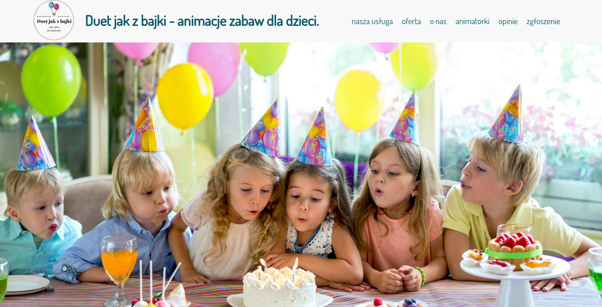
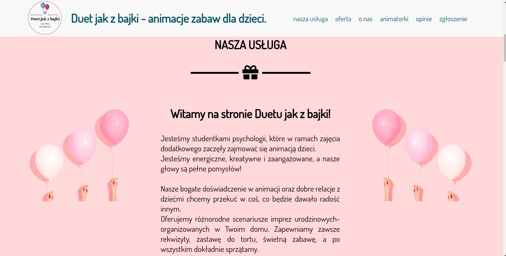
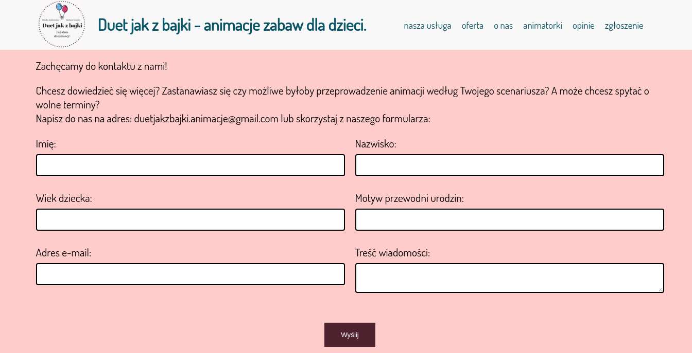

# MP-OPSS-1-PROJECT
Materiały na laboratoria z przedmiotu "Opracowywanie serwisów sieciowych cz.1"

### Wizytówka biznesowa
Celem projektu jest stworzenie strony internetowej za pomocą dokumentu HTML, która będzie stanowiła
wizytówkę biznesową Waszej usługi bądź produktu. Elementy wizytówki tj. obrazki i słowa dobieracie
w taki sposób, aby wywołać emocje u potencjalnego klienta, podczas których ten klient podejmie
korzystną dla Was decyzję, tj. decyzję zakupu Waszej usługi bądź produktu. Koncentrujecie się na
wywoływaniu emocji. Aby to skutecznie zrobić, musicie zdefiniować swojego użytkownika końcowego. Im
lepiej poznacie go, tym trafniej dobierzecie obrazki i słowa.

### Struktura wizytówki
Wizytówka składa się z trzech głównych części. Pierwsza część składa się z obrazka i tekstu, które
konkretnie i atrakcyjnie przekazują, co chcecie sprzedać. Musi to być na tyle dobrze zrobione, aby
potencjalny klient chciał zajrzeć głębię w stronę. Druga cześć opisuje dokładniej Wasz produkt bądź
usługę. Składa się z minimum jednej zakładki. Trzecią część stanowi formularz kontaktowy. Poniżej
przykład projektu zrealizowanego przez Panią Jagodę Stosik.
- pierwsza część:

- druga część

- trzecia część

### Struktura projektu
Projekt składa się z głównego pliku _html_ i _css_ oraz plików graficznych.

### Kryteria oceny
1. Złożoność (30%): czy są minimum trzy części; czy jest formularz; 
2. Styl (20%): czy jest podział na pliki html i css; czy są komentarze w
   dokumencie; czy są odpowiednie wcięcia; czy łamie tekst, aby wygodniej się
   czytało.
3. Marketing (25%): czy z pierwszej strony wizytówki jest jasne, co dokładnie
   się sprzedaje; czy kompozycja strony wzbudza odpowiednie emocje;
4. Publiczna prezentacja (25%): czy podczas prezentacji zaprezentowano się
   profesjonalnie; czy przestawiono założenia i cele projektowe w sposób jasny i
   atrakcyjny.

